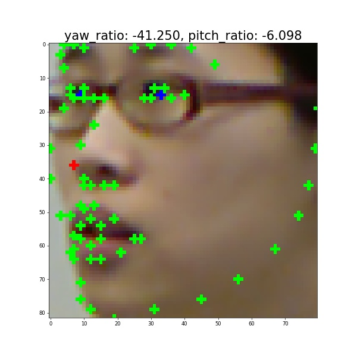
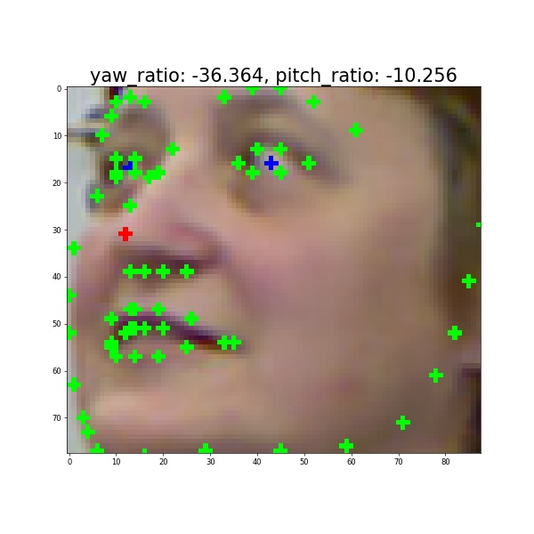
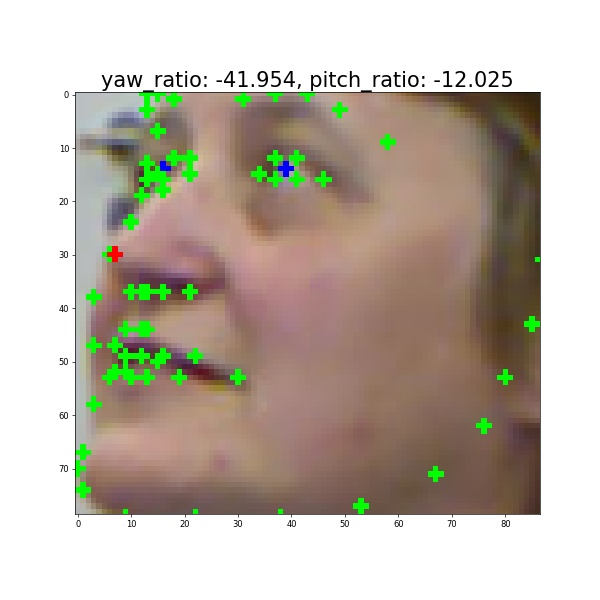
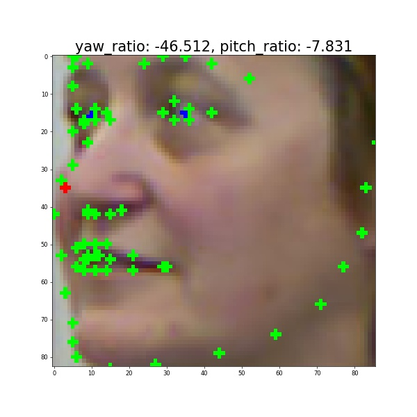

# Similar Head Pose Detection

Detect face images with similar poses to the reference image.

## Method
1. Detect 2D Face Landmarks using [face-alignment](https://github.com/1adrianb/face-alignment) detector.
2. Calculate **relative position of the tip of the nose** named yaw_ratio & pitch_ratio.<br>
yaw_ratio_range : -50 ~ 50(%), pitch_ratio_range : -50 ~ 50(%), 
3. Find images below threshold of yaw & pitch ratio.

## Result
Test images were from [BIWI DATASET](https://paperswithcode.com/dataset/biwi).
### Reference image


### Detected similar head pose images (Threshold : 7)




## Demo
### Estimate yaw_ratio & pitch_ratio on single image
```python
usage: estimate_pose.py [-h] --path PATH [--device DEVICE] [--fa FA] [--fa_thres FA_THRES] [--save_name SAVE_NAME]

Estimate face yaw & pitch ratio

optional arguments:
  -h, --help            show this help message and exit
  --path PATH           image path
  --device DEVICE       device select 'cuda' or 'cpu'
  --fa FA               select face detector 'sfd' or 'blazeface' or 'dlib'
  --fa_thres FA_THRES   face detect threshold
  --save_name SAVE_NAME result save name
```
**Example:**
```bash
python --path refer_img.png --device cuda --save_name refer_detected
```

### Detect similar head pose images
```python
usage: detect_similiar_pose_imgs.py [-h] --ref REF --dpath DPATH --save_path SAVE_PATH [--save_debug] [--allow_yaw_flip] [--device DEVICE] [--fa FA] [--fa_thres FA_THRES] [--threshold THRESHOLD]

Detect similiar head pose images

optional arguments:
  -h, --help            show this help message and exit
  --ref REF             reference image path
  --dpath DPATH         folder path to find similar head pose images
  --save_path SAVE_PATH save_folder
  --save_debug          whether to save unsimiliar imgs
  --allow_yaw_flip      whether to allow yaw flipped imgs
  --device DEVICE       device select 'cuda' or 'cpu'
  --fa FA               select face detector 'sfd' or 'blazeface' or 'dlib'
  --fa_thres FA_THRES   face detect threshold
  --threshold THRESHOLD yaw & pitch ratio threshold, default:7
```
**Example:**
```bash
python detect_similiar_pose_imgs.py --ref refer_img.png --dpath test_imgs --save_path detected --save_debug --device cuda --threshold 7
```
